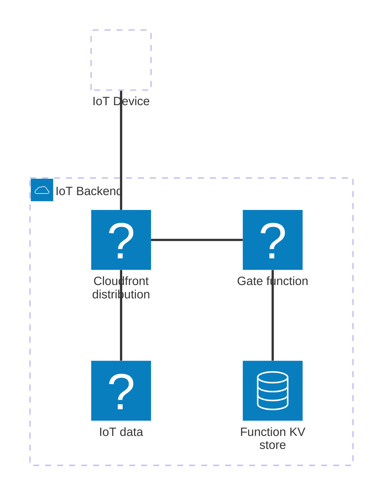

## Architecture

```mermaid
architecture-beta
    group iot_backend(cloud)[IoT Backend]
    service iot_data(logos:aws-s3)[IoT data] in iot_backend
    service cloudfront(logos:aws-cloudfront)[Cloudfront distribution] in iot_backend
    service gate_function(logos:aws-cloudfront)[Gate function] in iot_backend
    service gate_allowlist_data(database)[Function KV store] in iot_backend

    service device1[IoT Device]

    iot_data:T -- B:cloudfront
    gate_function:L -- R:cloudfront
    gate_function:B -- T:gate_allowlist_data
    device1:B -- T:cloudfront
```